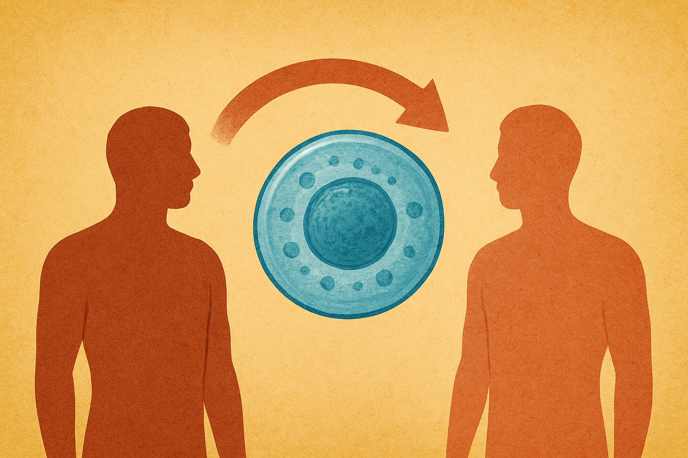
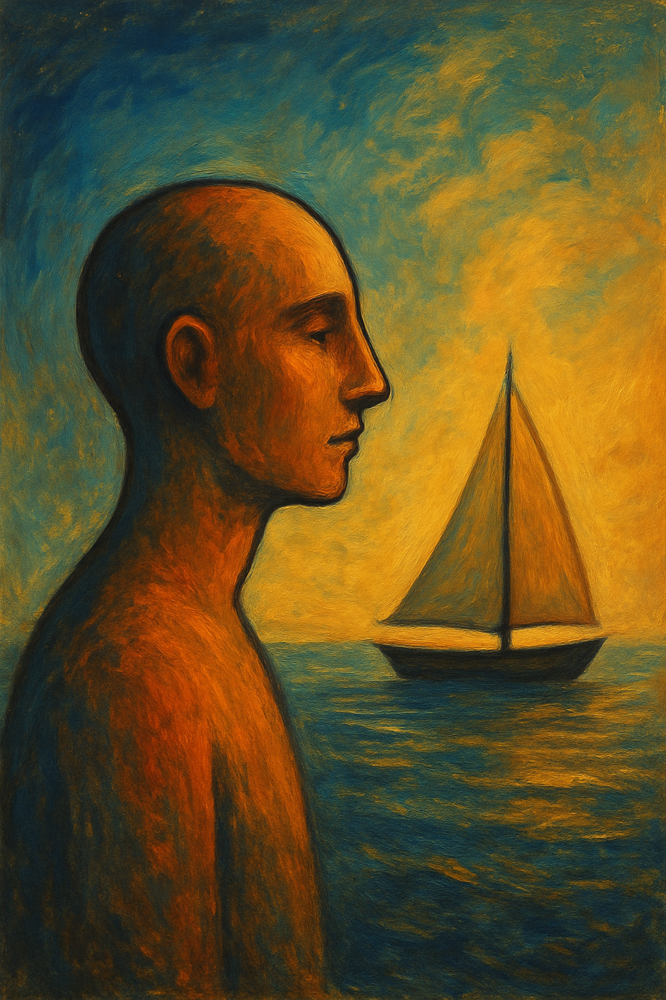

古希臘作家普魯塔克（[Plutarch](https://www.google.com/search?q=Plutarch)）曾記錄過一個 [思想實驗](https://zh.wikipedia.org/zh-tw/%E5%BF%92%E4%BF%AE%E6%96%AF%E4%B9%8B%E8%88%B9)：

雅典人為了紀念特修斯（[Theseus](https://www.google.com/search?q=Theseus)）從克里特島歸來，將他搭乘的船保留了下來。

隨著時間流逝，船上的木板逐漸腐朽，雅典人便一塊塊地拆除舊木板，換上新的木板。

直到有一天，這艘船上所有的零件都被替換過一輪。

這時，哲學家們開始爭論：

1. 這艘船還是原來那艘特修斯之船嗎？
2. 如果有人將拆下來的舊木板重新組裝成另一艘船，那麼，哪艘才是真正的「原船」？

這不只是個哲學悖論，更是拿來思考人生的好題材。

[人體細胞每 7–10 年就會完全更新一次](https://www.questdiagnostics.com/patients/blog/articles/do-my-cells-really-change-every-7-years)；換句話說，七年前的你與今天的你，早已不再共享任何一塊細胞。

我們的身體就像那艘不斷更換木板的船，處於永恆的變動之中。

這讓我思考：**既然生理硬體都在不斷更新，為什麼心理軟體卻停滯不前？**

---

美國知名領導力教練 [Marshall Goldsmith](https://www.google.com/search?q=Marshall+Goldsmith) 有句名言：

> What got you here won’t get you there.
>
> 帶你來這裡的，未必能帶你到想去的地方。

個人成長的關鍵，其實是反向學習（Unlearning）。

我們需要學會臣服（Surrender）：放手讓舊的自我死去，才能騰出空間給新的自我。

然而，**生活中最難的，不是向認識的人道別，而是和過去的自己說再見。**

人都無法游向新的地平線，直到有勇氣告別海岸。

---

突破自我最難的關卡，是誠實面對自己。

物理學家 [Richard Feynman](https://www.google.com/search?q=Richard+Feynman) 說過：

> The first principle is that you must not fool yourself — and you are the easiest person to fool.
>
> 首要原則是你不能欺騙自己 — 而你是最容易被騙的人。

法國啟蒙思想家盧梭（[Jean-Jacques Rousseau](https://www.google.com/search?q=Jean-Jacques+Rousseau)）也說：

> Nature never deceives us; it is we who deceive ourselves.
>
> 大自然不會欺騙我們，欺騙我們的是自己。

美國哲學家 [Eric Hoffer](https://www.google.com/search?q=Eric+Hoffer) 更是直言：

> We lie the loudest when we lie to ourselves.
>
> 我們用來欺騙自己的謊言是最大聲的。

自我反省乍看之下簡單，實際上卻極其困難；因為人很擅長欺騙自己。

很多時候，我們因為各種因素不敢面對內心真實的想法，所以乾脆編個謊話，假裝一切都沒事。

---

身體每七年就默默完成一次重生；但心智的重生，需要我們親手啟動。

有句拉丁文諺語是這麼說的：

> Mens sana in corpore sano
>
> 健全的心靈，寓於健康的身體。

我們可以像鍛鍊身體一樣鍛鍊大腦，每天進入「頭腦健身房」做「思想舉重」。

試著問自己：「**我相信的這件事，有沒有可能是錯的？**」

也許，你會體悟到：「**我以前堅信的，是錯的。**」

能同時容納這兩種矛盾的想法，正是智慧的展現。

美國小說家 [F. Scott Fitzgerald](https://www.google.com/search?q=F.+Scott+Fitzgerald) 曾說：

> The test of a first-rate intelligence is the ability to hold two opposed ideas in mind at the same time and still retain the ability to function.
>
> 一流智力的考驗，在於能否同時保有兩種對立觀點，並且還能正常行事。

質疑，是一種求知的態度。

假設，是看向世界的窗戶；如果沒有定期擦亮它們，光線就照不進來。

每天給自己一個機會，看見新東西、聽進新觀點、接受新刺激，藉此提升神經可塑性（[Neuroplasticity](https://www.google.com/search?q=Neuroplasticity)）。

唯有透過不斷地編輯信念、修改想法、升級思維，我們才能在快速變動的世界中，成為大腦的主人，而非僕人。

讓我們一起響應 1784 年德國哲學家康德（[Immanuel Kant](https://www.google.com/search?q=Immanuel+Kant)）在《[回答這個問題：什麼是啟蒙？](https://www.gutenberg.org/files/30821/30821-h/30821-h.htm)》中寫下的座右銘：

> Sapere aude! Habe Mut, dich deines eigenen Verstandes zu bedienen!
>
> 勇於求知吧！鼓起勇氣用自己的腦袋獨立思考！

---

我們現在的生活，都是過去想法塑造出的結果。

如果腦中充滿僵化、狹隘的思維模式，人生註定只能重複過去的軌跡。

唯一的限制，是自己設下的限制。

唯一糟糕的觀點，是困在其中、走不出去的那一個。

預設立場、先入為主的觀念會抹煞所有可能性。

若過度依賴某個觀點，很容易在不知不覺中忽略了真相。

為了避免夜郎自大，或陷入慣性思考的迴圈，我們需要撕掉標籤、拒絕守舊。

同時，也要打開心胸、保持好奇，用宏觀的角度和批判的態度看世界。

改變看世界的方式，就會改變所看見的世界。

也許你會發現，自己一直以來看見的，並不是世界的原貌，而是自身的投射。

---

以前，我花很多時間思考「我到底是誰？」，卻始終百思不得其解。

後來，我體會到：太刻意地想要回答這個問題，不僅多餘，甚至危險。

越長大，越察覺：**我，只是存在。**

在這趟人生旅途中，我不過是來旅行的。

此時此刻的我，是短暫且稍縱即逝的。

我，從未「完成」，也不會有「完成」的一天。

我，永遠都是「正在進行中」的作品。

我，永遠都處於「正在成為」的狀態。

我，沒有起點、中點或終點，也沒有所謂的 V1 或 V2 版本。

沒有過去的我需要緊抓不放，也沒有未來的我需要過度擔憂；

只有我 — 那個不完美，卻仍持續迭代、更新、進步、成長、變強的我。

---

喜憂參半是生活，起起落落是人生。

**[生命中唯一不變的事情就是變。](https://youtu.be/XNbaR54Gpj4)**

我需要做的，只是「擁抱改變」。

我需要在乎的，只是 [當下、現在、今天的我](https://huami.ng/dear-today-me)，有沒有努力「採取行動」。

關於這點，我想達爾文（[Charles Darwin](https://www.google.com/search?q=Charles+Darwin)）在《[物種起源](https://www.google.com/search?q=物種起源)》裡有最好的詮釋：

> It is not the strongest of the species that survives, nor the most intelligent that survives. It is the one that is the most adaptable to change.
>
> 最終能生存下來的物種，不是最強的、也不是最聰明的，而是最能適應改變的。

---

是時候跟過去的自己說再見了。

或許七年後，你會蛻變成連現在的自己都意想不到的樣子。

最後，我想引用 [小野](https://www.google.com/search?q=小野) 在《[有些事，這些年我才懂](https://www.books.com.tw/products/0010548551)》中的文字：

> 人生不是「是非題」，沒有絕對的對錯、是非和黑白。
>
> 人生的許多問題往往是相對的，常常是一體的兩面。
>
> 人生也不會是「選擇題」，不因爲你每次都作了正確完美的選擇，而有了正確完美的人生。
>
> 每個人的人生都不盡相同，所以正確的人生其實是不存在的。
>
> 人生是環環相扣的「問答題」，只有透過一次又一次的回答，才能撥雲見日，越來越明朗。
>
> 你越早去面對和思考這些問題，越不會讓自己像一球被弄亂的毛線球，理不出頭緒來，也不會繞了許多冤枉的路，最後被亂了的毛線球綑綁住自己，無法繼續前進。

