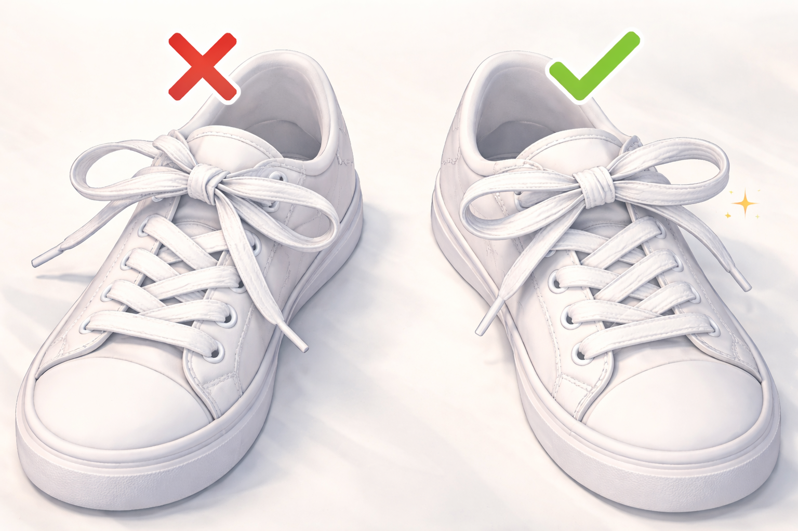

綁鞋帶這種事聽起來好像大家都會，但你有沒有過這種經驗：跑得正起勁，呼吸與步伐完美同步，低頭一看，鞋帶竟然鬆了！？

[前陣子在準備馬拉松的時候](https://huami.ng/2025/12/12/enoughness-9/#2)，被這個問題困擾許久；不管我怎麼綁，跑一跑它就是會鬆掉！

那種跑到一半，被迫停下來蹲在路邊重綁的感覺，就像開車遇到 99 秒的紅燈一樣，令人悲傷…

為了不再重蹈覆徹，我決定補修這門小時候沒學好的功課，好好研究清楚：**到底要怎麼綁，鞋帶才不會半路離家出走？**

# 那個「多出來」的洞真的不是裝飾品

我以前常在想，布鞋最上面、靠近踝關節那個「多出來」的洞，到底是幹嘛用的？是為了通風？還是用來掛平安符的？

別小看這個孔，兩位德國 [杜伊斯堡-埃森大學（Universität Duisburg-Essen）](https://www.uni-due.de/) 的運動科學家還真的研究過！

他們在《運動科學期刊》（Journal of Sports Sciences）有 [一篇論文](https://doi.org/10.1080/02640410802482425) 提到：**把鞋帶孔「穿好穿滿」，並適度拉緊，可顯著增加整體包覆感、減少腳跟滑動的情況。**

# 跑者結（The Runner’s Knot）

但問題來了，如果你只是穿過最後一個洞直接綁，通常會覺得腳踝被勒得很不舒服。

這時候，就不得不提「[跑者結（The Runner’s Knot）](https://www.google.com/search?q=The+Runner’s+Knot)」這個經典招式。

綁法如下：

1. 將鞋帶從外側穿入最後那個小孔，但不要拉到底，在兩側各自形成一個小圓圈（像米老鼠的耳朵）。
2. 把左邊的鞋帶，由上而下，穿進右邊的圓圈，右邊的穿進左邊。
3. 往兩旁拉緊，將腳踝固定，最後再打上你原本習慣的蝴蝶結。

這個小技巧又稱「**腳踝鎖定法（Heel Lock）**」。

完成後，你會立刻感受到一種「人鞋合一」的紮實包覆感。

這招學起來，保證你告別腳後跟磨破皮、起水泡的惡夢，也不用再擔心腳趾黑青啦！

<iframe width="560" height="315" src="https://www.youtube.com/embed/OBbc6TackDQ?si=pyEni-6W9fP4Egic&amp;controls=0&amp;start=68" title="YouTube video player" frameborder="0" allow="accelerometer; autoplay; clipboard-write; encrypted-media; gyroscope; picture-in-picture; web-share" referrerpolicy="strict-origin-when-cross-origin" allowfullscreen></iframe>

# 伊恩安全結（Ian’s Secure Shoelace Knot）

搞定了鞋子跟腳的親密關係，接下來就是「蝴蝶結」本人了。

先低頭看看蝴蝶結，如果總是歪歪扭扭的，那你可能跟我一樣，一直以來都打成容易鬆脫的「[阿嬤結（Granny Knot）](https://www.google.com/search?q=Granny+Knot)」了。

如果覺得一般的蝴蝶結怎麼打都會鬆，那你一定要認識這位來自澳洲、人稱「鞋帶教授」[Ian Fieggen](https://www.google.com/search?q=Ian+Fieggen)。

他發明的「[伊恩安全結（Ian’s Secure Shoelace Knot）](https://www.fieggen.com/shoelace/secureknot.htm)」，簡直就是跑者救星。

怎麼做呢？很簡單，就是在**打蝴蝶結的時候，其中一邊多繞一圈**，再穿過去。

這多繞的一圈能產生額外的摩擦力，讓鞋帶即便在劇烈運動中，也能穩如泰山。

<iframe width="560" height="315" src="https://www.youtube.com/embed/4zJqvN4kc50?si=DsIS3DGRSCL6f5RN&amp;controls=0" title="YouTube video player" frameborder="0" allow="accelerometer; autoplay; clipboard-write; encrypted-media; gyroscope; picture-in-picture; web-share" referrerpolicy="strict-origin-when-cross-origin" allowfullscreen></iframe>

# 魔鬼藏在細節裡

記得：打結時要注意「**相反原則**」。

如果一開始打底部平結時是「左繩壓右繩」，那麼在打蝴蝶結時，就要換成「右繩壓左繩」。

只要記住**第二次的方向要與第一次相反**，蝴蝶結就會乖乖地躺好；既平整漂亮，又不容易鬆脫。

再跟你分享一個秘訣：**把綁好的蝴蝶結，直接塞進前面左右交叉的鞋帶下方**。

這樣一來，鞋帶就會被牢牢壓住，想甩都甩不掉！

如果以上技巧都救不了你，不是你手殘，而是鞋帶本身的問題。

這裡有個小撇步：**選扁的鞋帶，盡量別選圓的**。

因為扁鞋帶的接觸面積大、摩擦力強，比起圓繩更不容易滑開。

# 別再讓鞋帶毀了你的好心情

讀到這邊，你可能會想：「不過就是綁個鞋帶，有必要這麼講究嗎？」

俗話說：「千里之行，始於足下」。

把鞋帶綁好，雖然只是個不起眼的小動作，投資報酬率卻極高！

只要出門前多花個十秒鐘，蹲下來搞定它，就能換來整趟路程的舒適與安心。

這筆交易，非常划算吧？

無論是馬拉松競技、爬山健行，還是日常走路，掌握這些小細節，就能跟綁鞋帶苦手說掰掰。

拒絕再次蹲在路邊綁鞋帶，就從今天開始，享受專注奔跑的自由吧！
