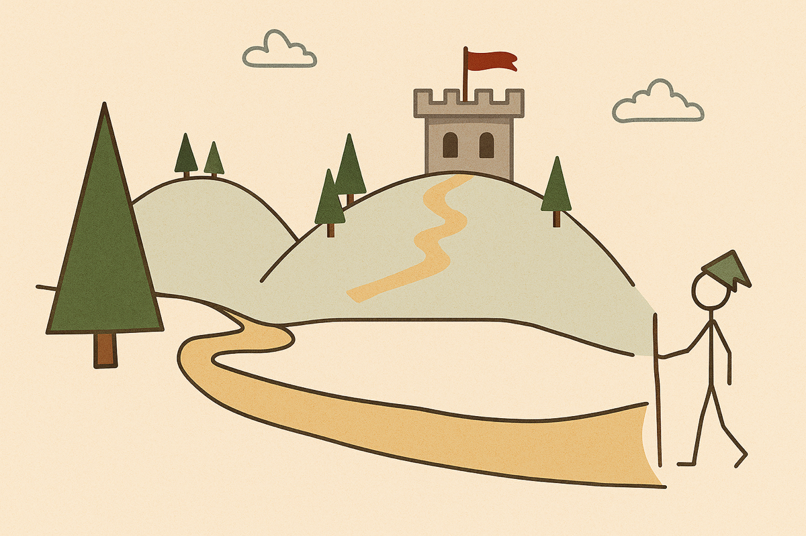

在這個社群媒體盛行的時代，我們很容易將自己的人生進度與他人比較，心裡開始擔憂：我是不是落後了？是不是該更努力一點？

但事實上，每個人都走在自己的時區。

每件事都在依循自己的時間表展開，就像世界各地的時鐘不會完全一致，每個人的人生軌跡也都有自己的時間軸。

我們必須摒棄那些所謂的普世價值，以及「我要在 X 歲前達成 X」的思考習慣。

花了 7 年才得到的 4 年學位還是個文憑。

50 歲才開始的事業還是能成就偉大。

65 歲才買的賓士還是一台賓士。

所有事情的發生，都有它的時機與理由，都是最好的安排。

每一次的際遇，都不是偶然，而是上天精心鋪設的道路，為了鍛鍊靈魂去承擔此生的使命，並引領我們遇見需要自己服務的那群人。

我們要做的，只是順應天性。

愛因斯坦（[Albert Einstein](https://www.google.com/search?q=Albert+Einstein)）說過：

> _Not everything that can be counted counts. Not everything that counts can be counted._
>
> 並非所有能計算的東西都重要，並非所有重要的東西都能被計算。

很多事情，往往不如想像的那麼糟糕，也不如想像的那麼美好。

我知道有人從未念過大學，但在 18 歲時就發現自己的「[天職](https://www.books.com.tw/products/0010969028)」，並且熱愛生命；我也知道有人剛畢業後，就進入大公司工作，賺了很多錢，卻開始厭惡自己。

我知道有人和另一半同居生活，心卻在別人那裡；我也知道有人真心深愛對方，彼此卻無法待在一起。

賈伯斯（[Steve Jobs](https://www.google.com/search?q=Steve+Jobs)）在 [2005 年的史丹佛大學畢業典禮](https://youtu.be/UF8uR6Z6KLc?t=308) 分享過這段話：

> _You can’t connect the dots looking forward; you can only connect them looking backwards._
>
> 你不能預先把生命中的點連接起來，只有在回頭時，才能看出它們是如何相互串連的。

沒錯，人生只有在多年後回顧時才能被理解，但在現在這個當下，必須不斷向前、不斷嘗試、不斷探索、不斷試錯、不斷迭代，最後就會找到屬於自己的信仰 — 那件只有你才能做得好的事情。

當你找到的時候，請梭哈：將所有時間、精神、注意力都奉獻投入。

---

**永遠不要拿自己和別人比較。**

就像日文所說的「桜梅桃李（おうばいとうり）」— 櫻、梅、桃、李，各自綻放，各自承載天地的安排。

人比人，氣死人；蛋餅比蛋餅，起士蛋餅…

若真的想要攀比，請和昨天的自己比，而不是和今天的某人比。

別被不屬於你的生活囚禁，也別在不屬於你的人生裡逗留。

如果想要剝奪過程中的樂趣，比較是最好的方式。

---

在只有自己的時區裡，難免感到孤單，也需要勇氣。

有時候會自我懷疑，這很正常，我懂。

這時候請記得：再做一個好的決定就好。

全神貫注地想下一步、做下一個行動。

在人生這條路上，並沒有所謂的「迷失」，每個人都在不斷地「尋找」。

沒有人能把一切都看透，也沒有人能搞清楚所有答案。

只有願意鼓起勇氣、邁出步伐，然後不斷往前走的人。

不要問路途還有多遠，而是問：我現在要跨出右腳，還是左腳？

這樣就夠了。

電影 [《絕地救援》（The Martian）](https://www.imdb.com/title/tt3659388/) 的 [結尾片段](https://www.youtube.com/watch?v=mDYCLFE86Po) 中，主角 [Mark Watney](https://www.google.com/search?q=Mark+Watney) 在一間教室裡，對著一群學生描述自己在火星上孤獨求生、面臨絕境時的心境：

> _At some point, everything’s gonna go south on you and you’re going to say, this is it. This is how I end. Now you can either accept that, or you can get to work. That’s all it is. You just begin. You do the math. You solve one problem and you solve the next one, and then the next. And If you solve enough problems, you get to come home._
>
> 在某個時刻，一切都會走下坡，你開始告訴自己：「到此為止了，這就是我的結局。」這時，我們可以選擇接受它，或者立刻動手去做。就是這麼簡單。你只需要開始，解決第一個問題，再解決第二個，然後第三個。當你解決了足夠多的問題，就能回家。

我很喜歡奧斯卡影帝 [Will Smith](https://www.google.com/search?q=Will+Smith) 的「[堆磚塊](https://www.youtube.com/watch?v=wIsgyIq_kFs&t=128s)」心態：

> _You don’t try to build a wall. You don’t start by saying, I’m going to build the biggest, baddest wall that’s ever been built. You say, I’m going to lay this brick as perfectly as a brick can be laid. You do that every single day, and soon you have a wall._
>
> 你不說：「我要蓋出一道完美的牆。」你說：「我要完美地擺放每塊磚頭，有一天，我就會蓋出一道完美的牆。」

專注於一磚一瓦的堆砌，築起屬於你的城牆和羅馬帝國，只是時間早晚的問題。

請記住：想移動高山，先搬走第一顆小石頭；想擁抱大海，先捧起手心裡的第一滴水。

這就像開夜車從台北前往高雄：車燈只能照亮前方三公尺，周圍一片漆黑，遠方的路況無法看清；但只要一直向前，那三公尺的光就會不斷延伸，最終帶領我們抵達終點。

---

沉住氣，保持耐心。一個可以精通耐心的人可以精通任何事物。

知道大自然的祕密嗎？「耐心」。

十年磨一劍，一生中所有長期好處都來自於複利效應 — 無論是健康、關係、財富 — 任何經得起時間考驗的東西都需要時間。

不要急，讓每一步都自然發生，時間會帶你到想去的地方。

我們常常把外在成就、頭銜和榮耀當作人生目標。

但**人生的價值，不在於贏得多少光鮮亮麗的獎牌，而是收集了多少傷痕和幫助過多少人。**

每一道傷痕，都是曾經努力過的證明與戰鬥過的痕跡。

比起獎牌，傷痕更能代表已經盡力、全力以赴。

這樣就夠了。

學會享受追求目標的過程，而不是把注意力放在最終結果。

如果想成為連續創業家，不能只想要成就感和社會影響力，還要願意承受龐大壓力、各種挑戰與無數次挫折。

如果想成為職業運動員，不能只想要觀眾的掌聲和高薪，還要願意承受枯燥的飲食、身體的酸痛與不斷重複的訓練。

如果想成為暢銷書作者，不能只想要忠實的讀者和簽書會，還要願意承受長時間孤獨的寫作、反覆修改與缺乏靈感的時刻。

人生 99% 以上的時間都在爬山，而不是在山頂。

目標的實現只是旅程中的一個里程碑，而非目的地。達成目標那刻，不過就像卸下背包一樣輕鬆，很無聊。重點是一路走來歷經的學習、成長與蛻變。

持續讓我們感到幸福的，不是登頂，而是沿途的風景。別因急於趕路前行，而忽略了值得駐足的美好。

擁有東西不會讓人快樂，追求的過程才有趣。期待的快感，往往比真正得到時還要強烈。

專注於自己的步調、節奏，享受每一步，並感恩同行的夥伴。

一個人走得快，一群人走得遠。

愛上追尋的感覺，因為旅程本身就是最棒的獎勵。

---

人生不是和別人競爭的短跑衝刺，而是和自己對話的長程馬拉松。

如果只能選一個，我們會希望自己走得遠，而非走得快。

下次當你感到焦慮時，請提醒自己：「我正活在自己的時區裡。」

人生進度並沒有快慢之分，只有各自的時區，沒有任何一區的時間是完全一樣的。

這個世界上並不存在所謂的路徑，我們必須開闢屬於自己的路徑。

這個世界上並不存在所謂的成功，我們必須定義屬於自己的成功。

這個世界上並不存在所謂的命運，我們必須創造屬於自己的命運。

拋棄社會框架的束縛和世俗眼光的期待，放下無謂的比較，不追逐他人的影子。

勇敢相信自己的選擇和直覺，給自己多一點耐心和信心。

相信自己跨出的每一步都是有意義的、都會受到全宇宙的幫助，如此就不會有恐懼跟害怕。

每顆星球都有自己的軌道，每個人也都在自己的時鐘下，照著自己的配速前進，遇到屬於自己的機會。

**每個人都活在自己的時區。**

**在這個屬於你的時區裡，一切都會準時。**

---

# 附錄

下面這份表格整理了不同人的人生進程，歡迎你補充更多人物故事，讓這份清單更豐富，也讓我們一起欣賞每個人的獨特旅程。

| 人物                                                                                         | 年齡  | 成就                                                                 |
| ------------------------------------------------------------------------------------------ | --- | -------------------------------------------------------------------- |
| [Mozart](https://www.google.com/search?q=Mozart)（莫札特）                                      | 5   | 開始創作音樂作品，已能熟練演奏鋼琴與小提琴                                                |
| [Shirley Temple](https://www.google.com/search?q=Shirley+Temple)（雪莉·坦普爾）                   | 6   | 以電影《亮晶晶的眼睛》成為好萊塢票房頂尖童星                                               |
| [Anne Frank](https://www.google.com/search?q=Anne+Frank)（安妮·法蘭克）                           | 12  | 開始寫《安妮日記》，被譽為「改變世界的十本書」之一                                            |
| [Magnus Carlsen](https://www.google.com/search?q=Magnus+Carlsen)（馬格努斯·卡爾森）                 | 13  | 成為國際象棋史上最年輕的特級大師                                                     |
| [Nadia Comăneci](https://www.google.com/search?q=Nadia+Comăneci)（娜迪亞·科馬內奇）                 | 14  | 拿下體操史上首個完美 10 分，並抱走三金                                                |
| [Tenzin Gyatso](https://www.google.com/search?q=Tenzin+Gyatso)（丹增嘉措）                       | 15  | 掌握西藏政權，成為世俗領袖                                                        |
| [Pele](https://www.google.com/search?q=Pele)（貝利）                                           | 17  | 成為最年輕的足球世界盃冠軍球員與得分者                                                  |
| [Richard Branson](https://www.google.com/search?q=Richard+Branson)（理查·布蘭森）                 | 19  | 創辦維珍集團                                                               |
| [Elvis Presley](https://www.google.com/search?q=Elvis+Presley)（貓王）                         | 19  | 舉行首場職業演出，正式踏入演藝圈                                                     |
| [John Lennon](https://www.google.com/search?q=John+Lennon)（約翰·藍儂）                          | 20  | 舉辦第一場披頭四演唱會                                                          |
| [Jesse Owens](https://www.google.com/search?q=Jesse+Owens)（傑西·歐文斯）                         | 22  | 首位單屆奧運獲得四面金牌的運動員                                                     |
| [Beethoven](https://www.google.com/search?q=Beethoven)（貝多芬）                                | 23  | 成為炙手可熱的鋼琴演奏家                                                         |
| [Roger Bannister](https://www.google.com/search?q=Roger+Bannister)（羅傑·班尼斯特）                | 25  | 首位突破 [4 分鐘一英里](https://en.wikipedia.org/wiki/Four-minute_mile) 障礙的人類 |
| [Albert Einstein](https://www.google.com/search?q=Albert+Einstein)（愛因斯坦）                   | 26  | 發表相對論論文                                                              |
| [Lance Armstrong](https://www.google.com/search?q=Lance+Armstrong)（藍斯·阿姆斯特朗）               | 27  | 贏得首座環法自行車賽冠軍                                                         |
| [Michelangelo](https://www.google.com/search?q=Michelangelo)（米開朗基羅）                        | 28  | 完成《聖殤像》與《大衛像》，展現其天才雕塑實力                                              |
| [Alexander the Great](https://www.google.com/search?q=Alexander+the+Great)（亞歷山大大帝）         | 30  | 建立橫跨希臘至印度的大帝國                                                        |
| [Amelia Earhart](https://www.google.com/search?q=Amelia+Earhart)（阿梅莉亞·埃爾哈特）                | 31  | 首位獨自無停靠跨越大西洋的女性飛行員                                                   |
| [J.K. Rowling](https://www.google.com/search?q=J.K.+Rowling)（J.K. 羅琳）                      | 32  | 歷經被 12 家出版社拒絕後，終於發表《哈利波特》第一集                                         |
| [Oprah](https://www.google.com/search?q=Oprah)（歐普拉）                                        | 32  | 開始主持《歐普拉秀》，開啟媒體女王之路                                                  |
| [Wright brothers](https://www.google.com/search?q=Wright+brothers)（萊特兄弟）                   | 32  | 創造世界上第一架受控動力飛行的飛機                                                    |
| [Edmund Hillary](<https://www.google.com/search?q=Edmund+Hillary>)（埃德蒙·希拉里）                | 33  | 首批征服「世界之巔 — 聖母峰」的人類                                                  |
| [Martin Luther King Jr.](https://www.google.com/search?q=Martin+Luther+King+Jr.)（馬丁·路德·金）  | 34  | 發表「I Have a Dream」演說，隔年獲得諾貝爾和平獎，成為歷屆最年輕的得主之一                         |
| [Jack Ma](https://www.google.com/search?q=Jack+Ma)（馬雲）                                     | 35  | 創立阿里巴巴集團，由英語教師轉型成為科技企業家                                              |
| [Marie Curie](https://www.google.com/search?q=Marie+Curie)（居禮夫人）                           | 36  | 獲得諾貝爾物理獎，後又獲化學獎，成為首位在不同科學領域兩度獲獎的女性                                   |
| [Vincent van Gogh](https://www.google.com/search?q=Vincent+van+Gogh)（梵谷）                   | 37  | 過世時鮮為人知，作品如今價值數百萬                                                    |
| [Neil Armstrong](https://www.google.com/search?q=Neil+Armstrong)（尼爾·阿姆斯壯）                  | 38  | 擔任阿波羅 11 號任務的指揮官，成為首位踏上月球的人類                                         |
| [Amancio Ortega](https://www.google.com/search?q=Amancio+Ortega)（阿曼西奧·奧爾特加）                | 39  | 開設第一間 Zara 門市，展開他的快時尚帝國                                              |
| [Mark Twain](https://www.google.com/search?q=Mark+Twain)（馬克·吐溫）                            | 40  | 40 歲寫《湯姆歷險記》，49 歲寫《哈克歷險記》                                            |
| [Christopher Columbus](https://www.google.com/search?q=Christopher+Columbus)（哥倫布）          | 41  | 發現美洲新大陸                                                              |
| [Rosa Parks](https://www.google.com/search?q=Rosa+Parks)（羅莎·帕克斯）                           | 42  | 拒絕讓座給白人乘客，成為美國民權運動的象徵                                                |
| [John F. Kennedy](https://www.google.com/search?q=John+F.+Kennedy)（甘迺迪）                    | 43  | 成為美國總統                                                               |
| [Henry Ford](https://www.google.com/search?q=Henry+Ford)（亨利·福特）                            | 45  | 推出 Ford T 汽車                                                         |
| [Suzanne Collins](https://www.google.com/search?q=Suzanne+Collins)（蘇珊·柯林斯）                 | 46  | 完成《飢餓遊戲》                                                             |
| [Charles Darwin](https://www.google.com/search?q=Charles+Darwin)（達爾文）                      | 50  | 出版《物種起源》                                                             |
| [Leonardo Da Vinci](https://www.google.com/search?q=Leonardo+Da+Vinci)（達文西）                | 51  | 完成繪製《蒙娜麗莎》                                                           |
| [Abraham Lincoln](https://www.google.com/search?q=Abraham+Lincoln)（林肯）                     | 52  | 成為美國總統                                                               |
| [Ray Kroc](https://www.google.com/search?q=Ray+Kroc)（雷·克羅克）                                | 53  | 買下麥當勞特許經營權並迅速擴展                                                      |
| [Dr. Seuss](https://www.google.com/search?q=Dr.+Seuss)（蘇斯博士）                               | 54  | 出版兒童文學經典繪本《[帽子裡的貓](https://www.google.com/search?q=帽子裡的貓)》           |
| [Colonel Harland Sanders](https://www.google.com/search?q=Colonel+Harland+Sanders)（哈蘭·桑德斯） | 61  | 創辦肯德基 KFC                                                            |
| [J.R.R. Tolkien](https://www.google.com/search?q=J.R.R.+Tolkien)（J.R.R. 托爾金）               | 62  | 出版《魔戒》三部曲                                                            |
| [Ronald Reagan](https://www.google.com/search?q=Ronald+Reagan)（雷根）                         | 69  | 成為美國總統                                                               |
| [Jack LaLanne](https://www.google.com/search?q=Jack+LaLanne)（傑克·拉倫）                        | 70  | [戴上手銬、鎖鏈拖曳 70 艘划艇](https://www.youtube.com/watch?v=skRb-oND3qA)      |
| [Nelson Mandela](https://www.google.com/search?q=Nelson+Mandela)（曼德拉）                      | 76  | 就任南非總統                                                               |
